# ACL2022

## Contrastive Visual Semantic Pretraining Magnifies the Semantics of Natural Language Representations 

一篇偏实验的文章 ，全文读下来学到的信息到不算很多，其实主要就是找到了一个与过往论文结论不符的现象，能够中ACL还是挺取巧的。 

这篇文章想要回答的问题：what benefits does contrastive visual semantic pretraining have for representations of natural language?

比较了GPT-2 and CLIP 提取出的contextualized English language representations的 **the geometry and semantic properties**

1、Our results indicate that **high anisotropy**（各向异性） is **not an inevitable consequence of contextualization**, and that visual semantic pretraining is beneficial not only for **ordering visual representations,** but also for encoding useful semantic representations of language, both **on the word level and the sentence level**.

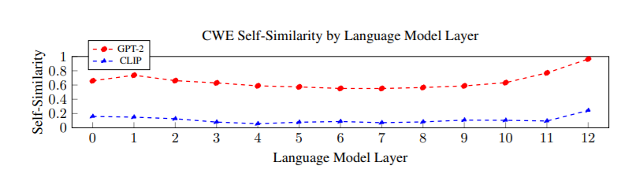

这里首先介绍了一下 Language Model Geometry

这篇文章其实就是反驳  **BERT, ELMo, & GPT-2: How contextual are contextualized word representations?** 论文的观点

考虑2句话中的dog

> A panda dog runs.

> A dog is trying to get bacon off its back

**Self-Similarity (SelfSim)**: The average cosine similarity of a word with itself across all the contexts in which it appears, where representations of the word are drawn from the same layer of a given model.     https://kawine.github.io/blog/nlp/2020/02/03/contextual.html#fn:3 这里简单介绍了一下概念

SelfSim(‘dog’) = 0.95

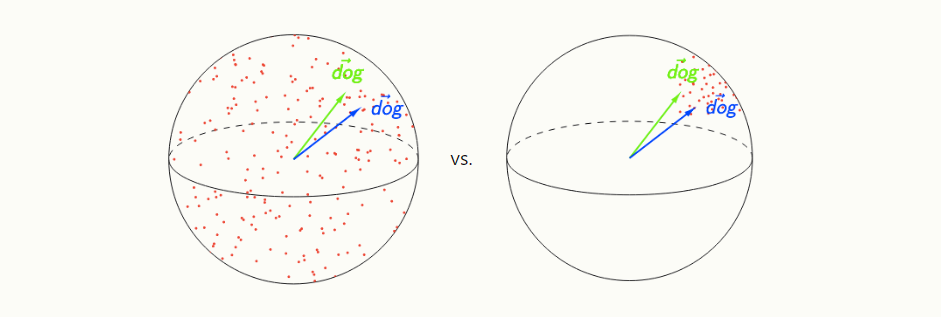

那么右图比左图更好considered highly contextualized

各向异性的计算

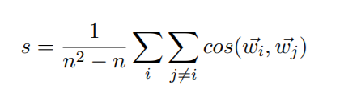

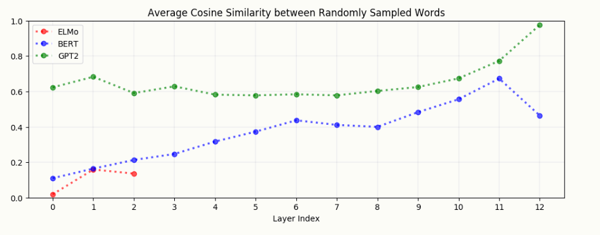

**In all layers of BERT, ELMo, and GPT-2, the representations of *all words* are anisotropic: they occupy a narrow cone in the embedding space instead of being distributed throughout.** 相当于所有的word embedding都集中在一个锥形区域上

考虑到anisotropic，我们考虑selfsim就需要做类似归一化的操作

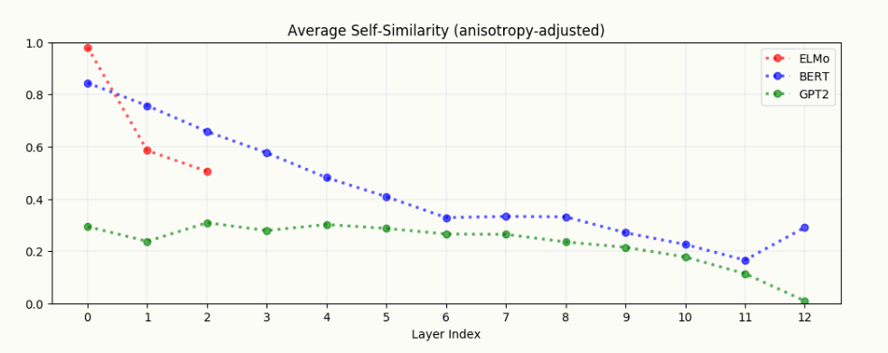

这篇论文的结论就是 upper layers of BERT and GPT-2 are extremely anisotropic, suggesting that high anisotropy is inherent to – or at least a consequence of – the process of contextualization:

接下来做了一些实验证明

CLIP outperforms GPT-2 on word-level and sentence-level semantic evaluations

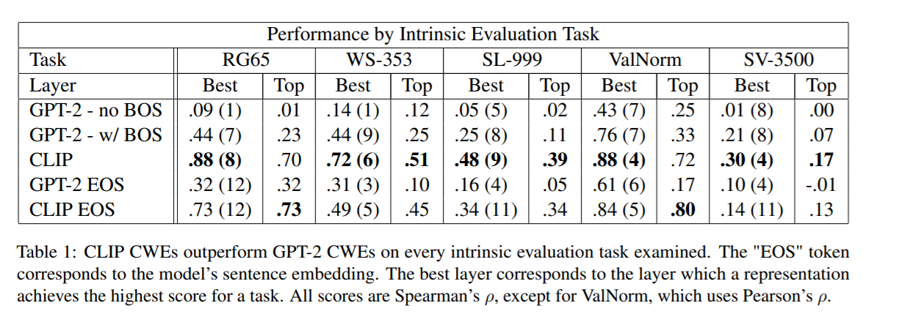

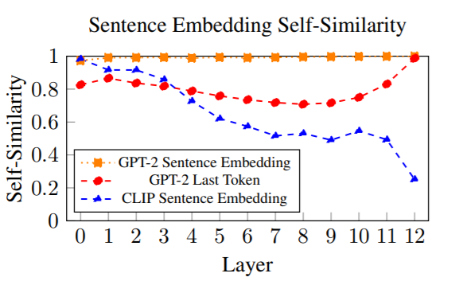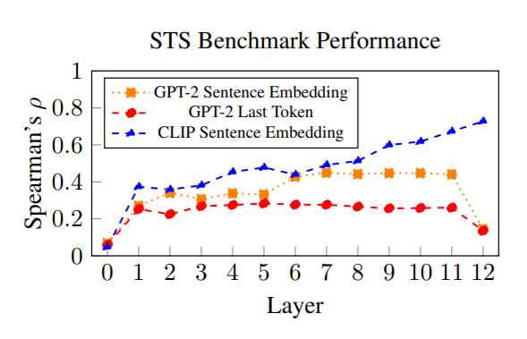

其实可以看到在sentence level 上的 self sim 就已经很低了，其实这是更直观的，由于与图像被映射到了同一空间，用这样一种对比学习的方法，所以肯定自相似度较低，这也可能是word level是self sim很低的原因. 因此说很多现象其实只是我们训练或优化方式导致的。

## Comprehensive Multi-Modal Interactions for Referring Image Segmentation

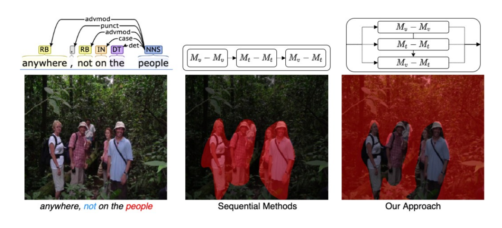

本文探究的 Referring Image Segmentation 大概就是上述这样一个任务，用自然语言去指导生成segmentation map

这样的设定可以摆脱原始CV对类别的限制。Substituting the pre-defined categories with natural language expressions (NLE) is a logical extension to counteract the above problems.  与Visual Grounding类似

 比较关键的是 referent object的确定

与以往有先后顺序 进行vision内部，Text 内部 VIsion-Text的 处理 ，存在error propagation

本文提出了

1、a Synchronous Multi-Modal Fusion Module(SFM)

2、Hierarchical Cross-Modal Aggregation Module (HCAM),

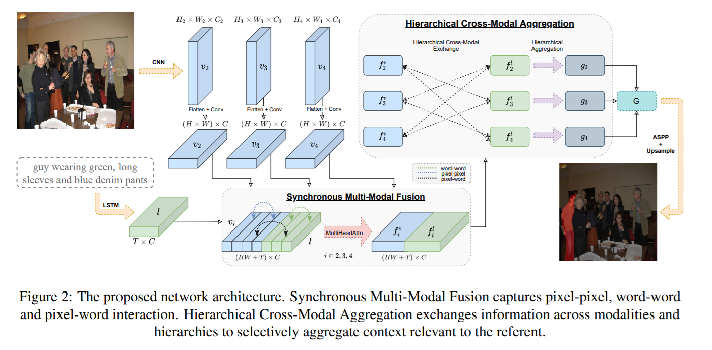

首先在特征提取阶段他通过CNN不同层层次化的信息。

### Synchronous Multi-Modal Fusion

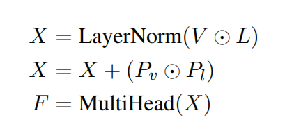

vision language 使用不同的positional embedding 之后就过一个multi-head attention ，作者觉得这样pixel-pixel, word-word and word-pixel interactions are captured

### Hierarchical Cross-Modal Aggregation

由于之前我们使用了层次化的视觉信息，这里我们就要保证不同层次间的一致性。使得all hierarchical features are focusing on common regions。

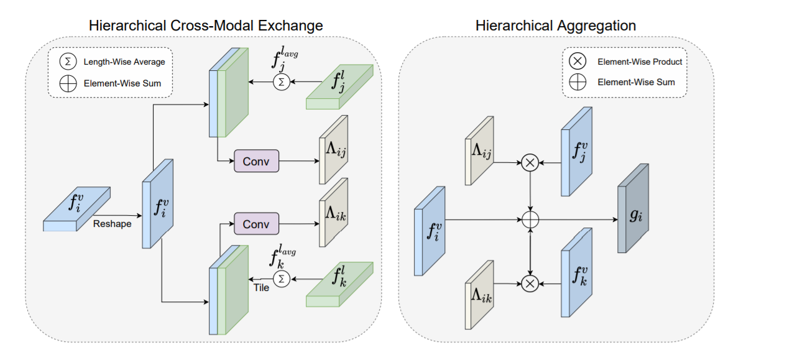

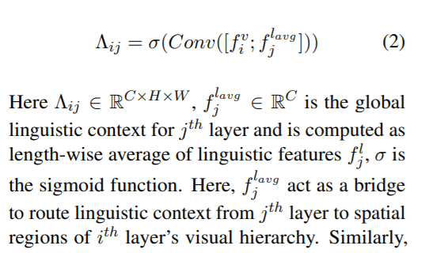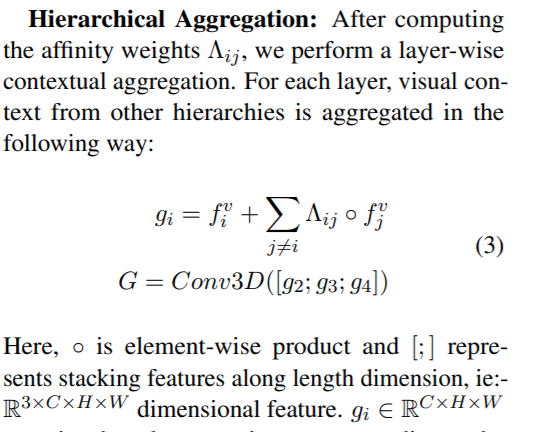

感觉这里直接用卷积有些略显生硬啊。

###  Mask Generation

G is passed through Atrous Spatial Pyramid Pooling (ASPP) decoder (Chen et al., 2018) and Up-sampling convolution to predict final segmentation mask S

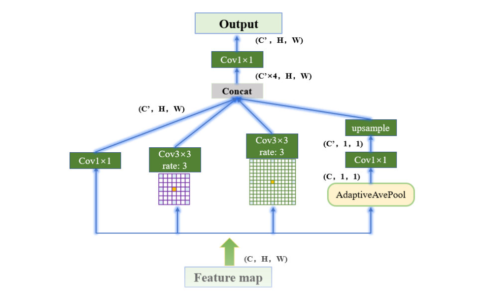

实验结果

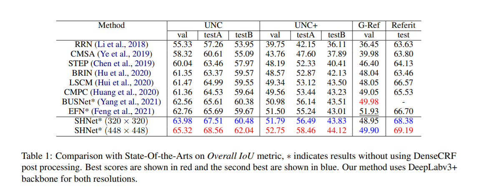

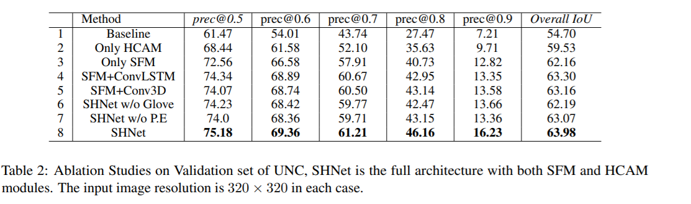

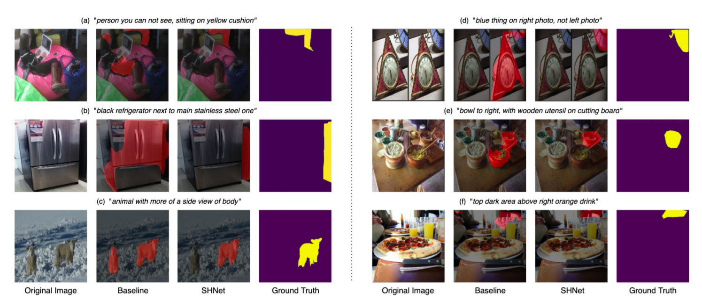

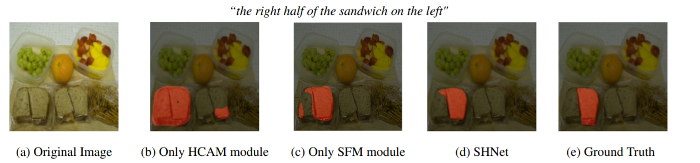

## Things not Written in Text: Exploring Spatial Commonsense from Visual Signals

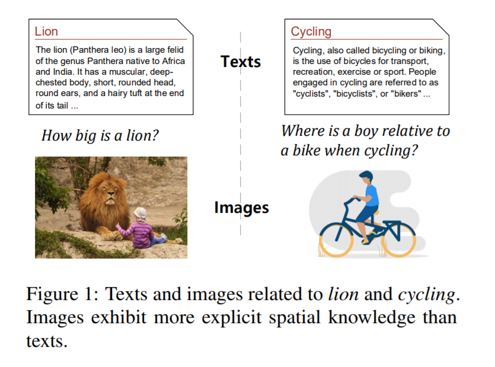

本文主要探讨的spatial commonsense（Object Scales  and Spatial Relationship)的问题，pretrained language models并不能很好的推理这一类空间常识,想法也挺直接的

本文主要研究了 Vision-Language PreTrained Models (VL-PTMs) and Image Synthesis Models (ISMs)  两个模型。

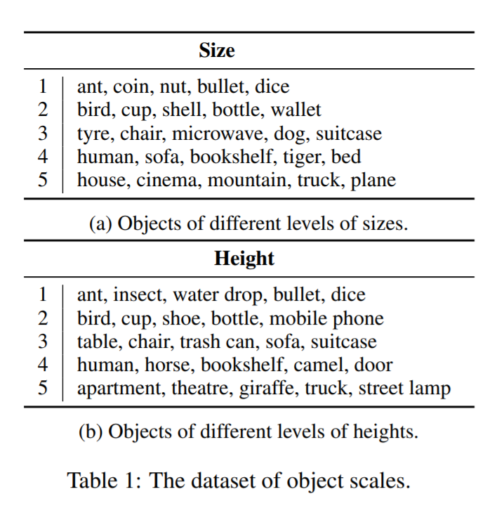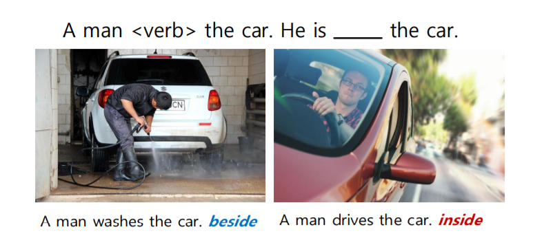

数据集构建大致如上所示Object Scales 主要在几组物体中比较，

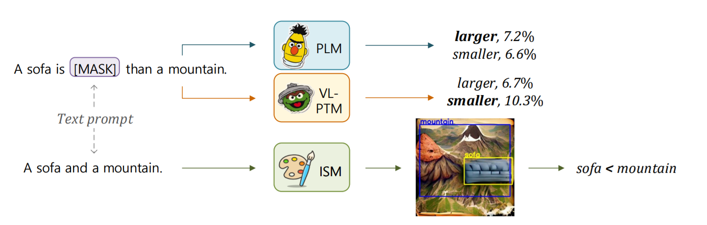

评估方式大致如上 ，ISM的评估需要考虑depth，需要使用We use the object detector from Zhang et al. (2021), and the depth estimator from Godard et al. (2019).  位置关系则需要使用 Visual Dependency Grammar (VDG)

这里有一个细节就是plm对prompt是敏感的，作者使用back-translation（这里其实就是翻译成另一种语音）生成多个prompt，因此这里作者分为五fold，先找到最优的prompt 然后再进行评估。

 Vision-Language PreTrained Models (VL-PTMs)使用的是 VinVL

ISMs 使用的是 VQGAN+CLIP

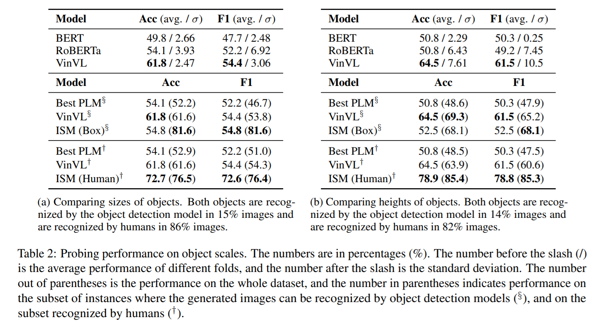

consistency 

相当于进一步研究了交换律和传递律A < B ∧ B < C =⇒ A < C， A < B =⇒ B > A

交换律和传递律A < B ∧ B < C =⇒ A < C， A < B =⇒ B > A

最后构建了一个a QA dataset进行验证

We generate an image about the question context a boy who is riding a bicycle with a text prompt using ISMs, and feed both the question and the generated image into vision-language models to predict an answer

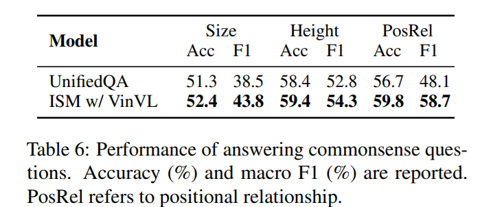

