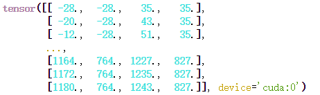

# GLIP


代码理解

GLIP/MODEL/glip_tiny_model_o365_goldg.pth


## 命令

```
hfai python tools/test_grounding_net.py --config-file /ceph-jd/pub/jupyter/zhumuzhi/notebooks/GLIP/configs/pretrain/glip_Swin_T_O365_GoldG.yaml --weight ./MODEL/glip_tiny_model_o365_goldg.pth \
        TEST.IMS_PER_BATCH 4 \
        MODEL.DYHEAD.SCORE_AGG "MEAN" \
        TEST.EVAL_TASK detection \
        MODEL.DYHEAD.FUSE_CONFIG.MLM_LOSS False \
        OUTPUT_DIR ./output3 \
        -- --nodes 1 --priority 10
```

```
hfai logs -f tools/test_grounding_net.py 

hfai stop tools/test_grounding_net.py 
```


## 

## 改动

为了适配于集群目前不连外网的情况

```
from transformers import AutoTokenizer
AutoTokenizer.from_pretrained(cfg.MODEL.LANGUAGE_BACKBONE.TOKENIZER_TYPE)
```

将之改为类似如下的形式

```
config = BertConfig.from_pretrained(self.bert_name,cache_dir=,local_files_only=True)
```


## **rpn.py** 

Module for RPN computation. Takes feature maps from the backbone and RPN proposals and losses. 

返回boxes以及loss

## **generalized_vl_rcnn.py**

定义了 class GeneralizedVLRCNN ，也就是整个模型的整体架构了

由以下三部分组成

1、backbone

2、  rpn 见 vldyhead.py

3、heads: takes the features + the proposals from the RPN and computes

​    detections / masks from it

例如在detection的任务下，caption为'person. bicycle. car. motorcycle. airplane. bus. train. truck. boat. traffic light. fire hydrant. stop sign. parking meter. bench. bird. cat. dog. horse. sheep. cow. elephant. bear. zebra. giraffe. backpack. umbrella. handbag. tie. suitcase. frisbee. skis. snowboard. sports ball. kite. baseball bat. baseball glove. skateboard. surfboard. tennis racket. bottle. wine glass. cup. fork. knife. spoon. bowl. banana. apple. sandwich. orange. broccoli. carrot. hot dog. pizza. donut. cake. chair. couch. potted plant. bed. dining table. toilet. tv. laptop. mouse. remote. keyboard. cell phone. microwave. oven. toaster. sink. refrigerator. book. clock. vase. scissors. teddy bear. hair drier. toothbrush'即类别组成的句子


### language_backbone

返回如下这些值

ret = {
            "aggregate": aggregate,                     #3x256x768
            "embedded": embedded,            #3x256x768
            "masks": mask,                  #将padding部分标位0
            "hidden": encoded_layers[-1]
        }

### visual_backbone

分两种，一种是单独的SWINT 只负责image feature

一种是

SWINT_VL

the backbone only update the "hidden" field, currently,对languge feature的hidden layer更新。

[2022-04-23 12:00:32.903059] swin out torch.Size([3, 96, 200, 304])
[2022-04-23 12:00:32.906505] swin out torch.Size([3, 192, 100, 152])
[2022-04-23 12:00:32.913978] swin out torch.Size([3, 384, 50, 76])
[2022-04-23 12:00:32.915966] swin out torch.Size([3, 768, 25, 38])

输出也就是把不同层的feature提取出来。

之后就是RPN部分，详细情况见后面那节

```
  proposals, proposal_losses, fused_visual_features = self.rpn(images, visual_features, targets, language_dict_features, positive_map,
                                              captions, swint_feature_c4)
```


最后还有一个ROI_HEAD

```
 x, result, detector_losses = self.roi_heads(
                    fused_visual_features, proposals, targets,
                    language_dict_features=language_dict_features,
                    positive_map_label_to_token=positive_map if not self.training else None
                )
```

不过目前我使用的模型并没有使用，之后可以去看看细节。

## vldyhead.py

也就是 rpn 部分

### VLFuse 

首先定义了 VLFuse 类

其内部主要就是一个attention层，用来对不同模态的类进行融合。

MHA-S 为单向只做T->I，MHA-B为双向


### VLDyHead 

应该是整个实现中最关键的地方了,


其内部的主体为一个dyhead_tower 由VLFuse ，language path (Bertencoder)和 vision path()三部分组成

并会根据需要使用的LOSS定义了一系列head

soft token head,contrastive alignment head, dot product soft token head.

如下是我目前使用的config中使用的Loss.

   USE_BACKBONE_SHALLOW_CONTRASTIVE_LOSS: False
      USE_CLASSIFICATION_LOSS: False
      USE_CONTRASTIVE_ALIGN_LOSS: False
      USE_DOT_PRODUCT_TOKEN_LOSS: True
      USE_FUSED_FEATURES_DOT_PRODUCT: True
      USE_LAYER_SCALE: True
      USE_SHALLOW_CONTRASTIVE_LOSS: False
      USE_SHALLOW_ZERO_PADS: False
      USE_TOKEN_LOSS: False

接着以 DOT_PRODUCT_TOKEN_LOSS，介绍一下具体实现的细节

```
self.dot_product_projection_image = nn.Identity()
self.dot_product_projection_text = nn.Linear(self.cfg.MODEL.LANGUAGE_BACKBONE.LANG_DIM,
                                                         num_anchors * channels, bias=True)
self.log_scale = nn.Parameter(torch.Tensor([log_scale]), requires_grad=True)
```

dot_product_proj_tokens 由language embedding得到，shape 为 bsx256x256

```
embedding = F.normalize(embedding, p=2, dim=-1)
dot_product_proj_tokens = self.dot_product_projection_text(embedding / 2.0)
dot_product_proj_tokens_bias = torch.matmul(embedding, self.bias_lang) + self.bias0
```

dot_product_proj_queries 由 visual output得到 这里的visual output是金字塔结构的所以我们以其中一级为例

shape 为 bs, 256,100, 152 ，之后将hxw拉成序列便成了quiries ,bsx256x15200,这就与之后的BOX_LIST对应上了

dot_product_logit 实质上就是 queries 和 token 直接做dot product,shape为bs x15200x256

### VLDyHeadModule

对VLDyHead进行进一步封装,可观察它的输入和输出。

```
box_cls, box_regression, centerness, token_logits, \
        proj_tokens, contrastive_logits, dot_product_logits, mlm_logits, shallow_img_emb_feats, fused_visual_features = self.head(features,
                                                                        language_dict_features,
                                                                        embedding,
                                                                        swint_feature_c4
                                                                        )
```

print("box",box_cls[0].shape,box_regression[0].shape,centerness[0].shape)

box torch.Size([3, 80, 100, 152]) torch.Size([3, 4, 100, 152]) torch.Size([3, 1, 100, 152])，这些都是基于卷积得到的

```
 self.cls_logits = nn.Conv2d(channels, num_anchors * num_classes, kernel_size=1)
 self.bbox_pred = nn.Conv2d(channels, num_anchors * 4, kernel_size=1)
 self.centerness = nn.Conv2d(channels, num_anchors * 1, kernel_size=1) 
```

这个centerness的含义是什么？


接着还会产生anchors

```
 anchors = self.anchor_generator(images, features)
```

For a set of image sizes and feature maps, computes a set of anchors
每张图会生成一些了的BoxLists



其内部记录的就是BOX位置的四个坐标吧，但具体这么做的意义是什么还不清楚

接下来就分为train和test


**train**会计算一系列Loss

```
loss_box_cls, loss_box_reg, loss_centerness, loss_token, loss_contrastive_align, loss_dot_product_token, loss_shallow_contrastive = self.loss_evaluator(
            box_cls, box_regression, centerness, targets, anchors,
            captions,
            positive_map,
            token_logits,
            proj_tokens,
            contrastive_logits,
            dot_product_logits,
            text_masks,
            shallow_img_emb_feats
        )
```


**test**

```
self.box_selector_test(box_regression, centerness, anchors,
                                       box_cls,
                                       token_logits,
                                       dot_product_logits,
                                       positive_map,
                                       )
```

其中最关键 的是以下这步，见inference.py

```
 def forward_for_single_feature_map(self, box_regression, centerness, anchors,
                                       box_cls=None,
                                       token_logits=None,
                                       dot_product_logits=None,
                                       positive_map=None,
                                       ):
```

首先计算 box_cls  shape为 bs,15200,80

这里的box_cls可以是原始的结果，或者是基于dot_product_logits 

然后 通过 self.pre_nms_thresh 筛选出 candidate_inds 

box_cls = box_cls * centerness[:, :, None] ，从这里可以看出centerness是一个分数，但其具体的含义我不是很清楚。

最终进行

```
detections = self.box_coder.decode(
                per_box_regression[per_box_loc, :].view(-1, 4),
                per_anchors.bbox[per_box_loc, :].view(-1, 4)
            )
```

可以看到这里同时用了box_regression 和 anchors的结果。这也就是anchors的发挥作用的地方。

这里就可以理解anchors的作用了，anchors提供的是绝对的位置，而box_regression预测的是相对的位置

```
 pred_ctr_x = dx * widths[:, None] + ctr_x[:, None]
 pred_ctr_y = dy * heights[:, None] + ctr_y[:, None]
 pred_w = torch.exp(dw) * widths[:, None]
 pred_h = torch.exp(dh) * heights[:, None]
```

        pred_boxes = torch.zeros_like(preds)
        pred_boxes[:, 0::4] = pred_ctr_x - 0.5 * (pred_w - 1)
        pred_boxes[:, 1::4] = pred_ctr_y - 0.5 * (pred_h - 1)
        pred_boxes[:, 2::4] = pred_ctr_x + 0.5 * (pred_w - 1)
        pred_boxes[:, 3::4] = pred_ctr_y + 0.5 * (pred_h - 1)


## Dataset

 Cannot find coco/annotations/instances_val2017.json in ['./', './DATASET', './OUTPUT', './data', './MODEL']

构建soft-link 使用public_dataset下的COCO

/public_dataset/1/COCO/annotations

ln -s /public_dataset/1/COCO/annotations  /ceph-jd/pub/jupyter/zhumuzhi/notebooks/GLIP/DATASET/coco

ln -s /public_dataset/1/COCO/val2017 /ceph-jd/pub/jupyter/zhumuzhi/notebooks/GLIP/DATASET/coco

## RESULT

之前模型load的时候出了问题，修正后最终的结果如下所示


